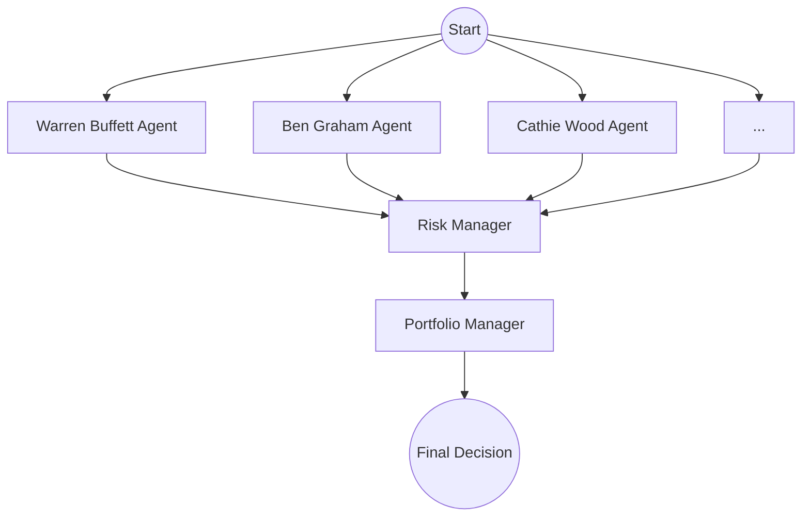

# AI Hedge Fund 🚀

An AI-powered hedge fund that employs a multi-agent system to make informed trading decisions. This project uses **LangGraph** to orchestrate specialized agents, each with a unique investing style, and leverages local data pipelines (DuckDB & yfinance) for comprehensive market analysis.

> [!IMPORTANT]
> This project is for **educational purposes only**. It is a proof of concept and should not be used for real trading or investment.

---

## 🏗️ Architecture

The system is built on a directed acyclic graph (DAG) where information flows from analysts to risk management, and finally to the portfolio manager.



1.  **Analysts**: Multiple agents analyze the stock from different perspectives (Value, Growth, Technical, Sentiment, etc.).
2.  **Risk Manager**: Reviews the analyst signals and ensures proposed trades stay within risk parameters (e.g., max position size).
3.  **Portfolio Manager**: Makes the final decision (Buy, Sell, or Hold) based on the combined wisdom of analysts and risk constraints.

---

## 🤖 The Analysts

The fund employs a diverse team of "virtual" analysts, each inspired by legendary investors or specialized disciplines:

| Analyst | Investing Style |
| :--- | :--- |
| **Warren Buffett** | The Oracle of Omaha. Seeks wonderful companies at a fair price. |
| **Ben Graham** | The Father of Value Investing. Emphasizes a margin of safety. |
| **Cathie Wood** | The Queen of Growth Investing. Focuses on disruptive innovation. |
| **Michael Burry** | The Big Short Contrarian. Hunts for deep value and asymmetric bets. |
| **Aswath Damodaran** | The Dean of Valuation. Rigorous intrinsic value analysis. |
| **Technical Analyst** | Chart Pattern Specialist. Analyzes trends and indicators (RSI, MACD, etc.). |
| **Sentiment Analyst** | Market Psychology Specialist. Gauges investor behavior and news sentiment. |
| **Nassim Taleb** | Black Swan Risk Analyst. Focuses on antifragility and tail risk. |

*(And many more, including Charlie Munger, Peter Lynch, Stanley Druckenmiller, etc.)*

---

## 📊 Data Pipeline

Unlike many AI trading projects that rely on expensive external APIs, this system uses a high-performance local data bridge:

*   **Price Data**: Fetched dynamically via `yfinance`.
*   **Financials**: Sourced from a local **DuckDB** database containing scraped data from Screener.in.
*   **News & Sentiment**: Powered by an internal **Announcements** pipeline stored in DuckDB, providing real-time sentiment analysis of company filings.

---

## 🚀 Getting Started

### Prerequisites
*   Python 3.10+
*   Poetry (recommended) or pip

### Installation
1.  Clone the repository:
    ```bash
    git clone https://github.com/your-repo/stock_data_pipelines.git
    cd stock_data_pipelines/ai-hedge-fund
    ```
2.  Install dependencies:
    ```bash
    poetry install
    ```
3.  Set up environment variables:
    Create a `.env` file in the root directory and add your LLM provider keys (e.g., OpenAI, Anthropic, or local via LMStudio).
    ```env
    OPENAI_API_KEY=your_key_here
    # Optional: For local LLMs
    # OPENAI_API_BASE=http://localhost:1234/v1
    ```

---

## 🛠️ Usage

### 1. Run a Single Analysis
Analyze one or more stocks for a specific date range:
```bash
python src/main.py --tickers RELIANCE,TCS --start-date 2024-01-01 --end-date 2024-03-31
```

### 2. Run a Backtest
Simulate the fund's performance over time:
```bash
python src/backtester.py --tickers RELIANCE,TCS --start-date 2023-01-01 --end-date 2023-12-31 --initial-cash 100000
```

### CLI Flags
*   `--tickers`: Comma-separated list of symbols (e.g., `AAPL,MSFT` or `RELIANCE`).
*   `--start-date` / `--end-date`: Date range in `YYYY-MM-DD` format.
*   `--show-reasoning`: Print the internal thought process of each agent.
*   `--model`: Specify the LLM to use (e.g., `gpt-4o`).

---

## 🚶 Walkthrough Example

Let's walk through what happens when you run `python src/main.py --tickers TCS --show-reasoning`.

1.  **Initialization**: The system fetches historical prices for TCS and financial metrics from the local DuckDB.
2.  **Analyst Deliberation**:
    *   **Warren Buffett** analyzes the ROE and Debt/Equity, deciding if TCS is a "wonderful business."
    *   **Technical Analyst** calculates that the RSI is 30 (oversold) and suggests a Buy.
    *   **Sentiment Analyst** reads recent NSE announcements and notes positive earnings surprises.
3.  **Risk Check**: The Risk Manager sees multiple Buy signals but limits the position size to 10% of total capital to maintain diversification.
4.  **Portfolio Decision**: The Portfolio Manager aggregates all signals. If the consensus is strong, it issues a **BUY** order for a specific number of shares.
5.  **Output**: You get a structured table showing the final decision, share quantity, and a summary of each agent's reasoning.

---

## 📁 Project Structure

*   `src/agents/`: Individual agent definitions and logic.
*   `src/graph/`: LangGraph state and workflow configuration.
*   `src/tools/`: The Data Bridge (yfinance + DuckDB).
*   `src/utils/`: Display formatting and helper functions.
*   `src/backtesting/`: The engine for historical simulations.