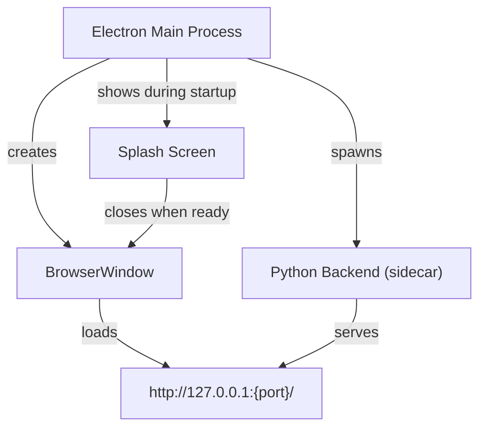

# Walkthrough: Desktop Application (Electron + Python Sidecar)

## Overview

Converted the existing Python web application into a **production-scale desktop application** using the **Electron + Python Sidecar** architecture – the same approach used by Discord, Slack, VS Code, and the official TradingView desktop app.


## Architecture



**How it works:**
1. Electron starts and shows a **splash screen** while booting.
2. It spawns the **Python backend** on a dynamically allocated free port.
3. It polls the `/api/health` endpoint until the backend is ready.
4. It opens the **main window** loading the app from the local server.
5. When the user closes the window, Electron gracefully kills the Python process.

## Files Created

### Centralized Path Management
| File | Purpose |
|------|---------|
| [paths.py](file:///d:/projects/stock_data_pipelines/paths.py) | Separates read-only assets (bundled) from writable data (databases). Works in both dev and PyInstaller-bundled modes. |

### Electron Application
| File | Purpose |
|------|---------|
| [electron/main.js](file:///d:/projects/stock_data_pipelines/electron/main.js) | Main process: spawns Python sidecar, manages windows, lifecycle. Auto-detects `.venv` in dev mode. |
| [electron/preload.js](file:///d:/projects/stock_data_pipelines/electron/preload.js) | Secure context bridge for renderer process. |
| [electron/splash.html](file:///d:/projects/stock_data_pipelines/electron/splash.html) | Premium dark-themed splash screen with animated gradient and spinner. |
| [electron/package.json](file:///d:/projects/stock_data_pipelines/electron/package.json) | Electron project config with electron-builder settings for Windows NSIS and Mac DMG. |

### Build Scripts
| File | Purpose |
|------|---------|
| [build_scripts/package_python.py](file:///d:/projects/stock_data_pipelines/build_scripts/package_python.py) | Packages the Python backend into a standalone executable using PyInstaller. |
| [build_scripts/build_desktop.py](file:///d:/projects/stock_data_pipelines/build_scripts/build_desktop.py) | Master orchestrator: PyInstaller → npm install → electron-builder. |

## Files Modified

| File | Change |
|------|--------|
| [db/db_utils.py](file:///d:/projects/stock_data_pipelines/db/db_utils.py) | Switched to centralized `paths.py` for all database paths. |
| [tradingview_ui/server.py](file:///d:/projects/stock_data_pipelines/tradingview_ui/server.py) | Import paths from `paths.py` for UI, charts, CSV, and DB directories. |
| [announcement_fetcher/fetcher.py](file:///d:/projects/stock_data_pipelines/announcement_fetcher/fetcher.py) | Use `paths.py` for data directory and CSV paths. |
| [announcement_fetcher/helper.py](file:///d:/projects/stock_data_pipelines/announcement_fetcher/helper.py) | Removed `os.chdir("..")` hack; use `paths.py` instead. |
| [requirements.txt](file:///d:/projects/stock_data_pipelines/requirements.txt) | Added `pyinstaller`. |

## How to Run

### Development Mode
```powershell
cd d:\projects\stock_data_pipelines\electron
npm start
```
This auto-detects the `.venv` Python, starts the backend on a free port, and opens the desktop window.

### Build Production Installer

#### Step-by-step:
```powershell
# 1. Install pyinstaller if not already installed
pip install pyinstaller

# 2. Package Python backend
python build_scripts/package_python.py

# 3. Build Electron installer
cd electron
npm run dist:win    # Windows → .exe installer
npm run dist:mac    # macOS   → .dmg installer
```

#### Or use the master build script:
```powershell
python build_scripts/build_desktop.py
```

The final installer will be in `electron/dist/`.

## Validation Results

- ✅ `paths.py` correctly resolves dev-mode paths
- ✅ All server imports work with the new path management
- ✅ Electron app launches, connects to Python sidecar, and displays the full TradingView UI
- ✅ Splash screen shown during backend startup
- ✅ Application menu with File, View, Developer, and Help menus

> [!NOTE]
> **To build the final .exe installer**, you need to run `python build_scripts/build_desktop.py`. This is a longer process that packages all Python dependencies and produces the distributable. For Mac builds, run the same script on a Mac.
